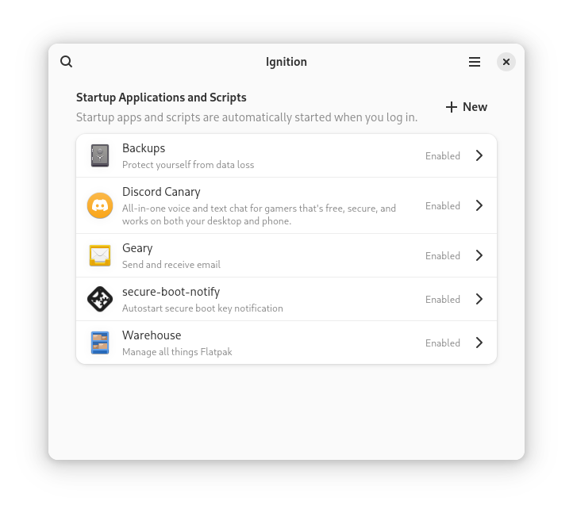

# 🛠️ Ignition

## Ignition is a minimal app for editing autostart entries on Freedesktop-compliant Linux distributions.



## 🚀 Main Features:

1. View your startup entries
2. Create startup entries for installed apps
3. Create startup entries for saved scripts
4. Create startup entries for arbitrary commands

## ⏬ Installation:

Ignition is not currently hosted on any software center. Until then, you can follow the **Installation from Repo Steps** in this document.

## 🗣️ Translation
- Translation is hosted with Weblate on Fyra Labs, [click here](https://weblate.fyralabs.com/projects/flattool/ignition/) to contribute

<a href="https://weblate.fyralabs.com/engage/ignition/">

</a>

## 💬 Get in Contact

- We have a [Discord Server](https://discord.gg/Sq85C42Xkt) and a [Matrix Space](https://matrix.to/#/#warehouse-development:matrix.org) to discuss and send announcements in!
- You can always open issues, PRs, and use other GitHub features here

## 📜 Code of Conduct
- The Ignition project follows the [GNOME Code of Conduct](https://conduct.gnome.org/). See `CODE_OF_CONDUCT.md` for more information.

## 🛠️ Installation from Repo Steps:
1. Visit the [releases](https://github.com/flattool/ignition/releases) page and download `io.github.flattool.Ignition.Flatpak`.
2. Install it using your software store or run the following command:
   ```shell
   flatpak install /path/to/io.github.flattool.Ignition.flatpak
   ```
You're all set! Launch the application by clicking its icon in your app menu or running:
```shell
flatpak run io.github.flattool.Warehouse
```

## 👥 Contributing

### Compiling from Source

Make sure `flatpak` and `git` are installed, then run the following to build from the repo:
```bash
# Clone this repo and enter it
git clone https://github.com/flattool/ignition
cd ignition

# Install build dependencies
flatpak install org.flatpak.Builder org.gnome.Sdk//47 org.gnome.Platform//47 org.freedesktop.Sdk.Extension.node20//24.08 -y

# Build and install Ignition
flatpak run org.flatpak.Builder _build ./build-aux/io.github.flattool.Ignition.json --install --user --force-clean
```